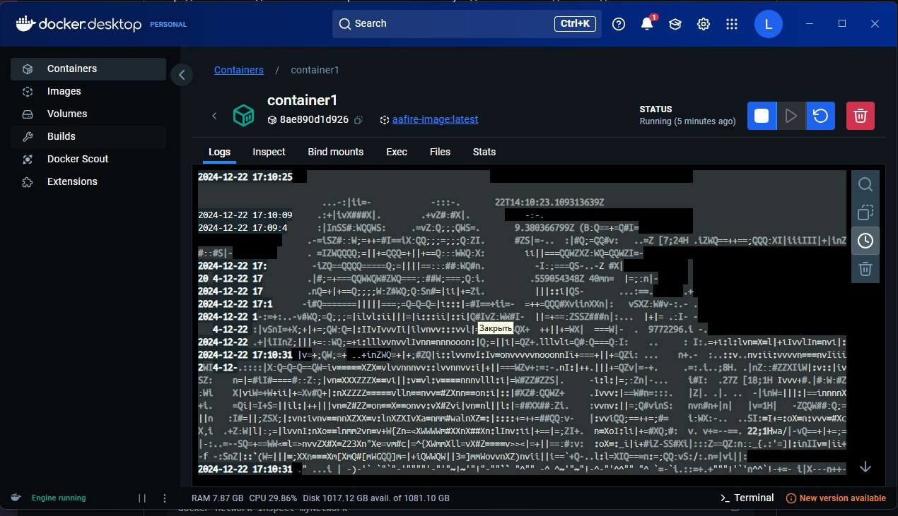
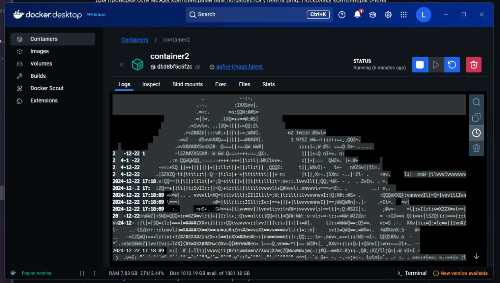
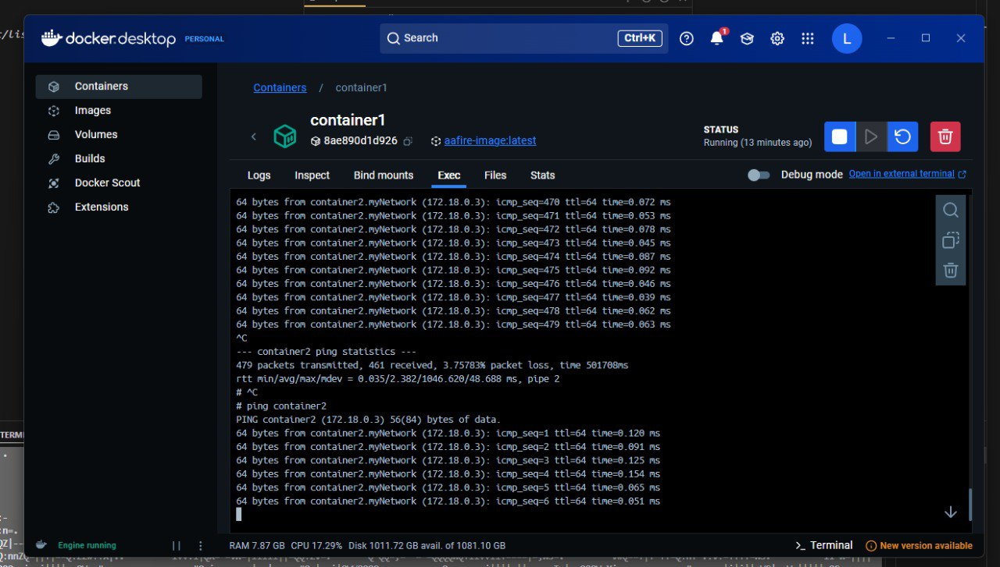

# Настройка сети между Docker контейнерами

1. Создали Dockerfile со следующим содержимым:
Мы создаем файл Dockerfile, который содержит инструкции для сборки Docker-образа. Dockerfile позволяет автоматизировать процесс создания образа, что упрощает развертывание приложений. Использование базового образа ubuntu:latest обеспечивает доступ к стандартной среде Ubuntu, что удобно для установки необходимых пакетов.
```dockerfile
FROM ubuntu:latest

ENV TERM=xterm

RUN apt-get update && apt-get install -y \
    libaa-bin \
    iputils-ping \
    && rm -rf /var/lib/apt/lists/*

CMD ["aafire"] 
```
- FROM ubuntu:latest: указывает, что мы начинаем с последней версии Ubuntu.
- ENV TERM=xterm: устанавливает переменную окружения для терминала.
- RUN apt-get update && apt-get install -y ...: обновляет списки пакетов и устанавливает необходимые утилиты.
- CMD ["aafire"]: задает команду, которая будет выполнена при запуске контейнера.

2. Собрали docker-image:
Мы собираем образ с помощью команды docker build. Сборка образа создает исполняемую среду, которая будет использоваться для запуска контейнеров. Использование флага -t позволяет задать имя образа, что упрощает его идентификацию.
```bash
docker build -t aafire-image .
```
- docker build: команда для сборки образа.
- -t aafire-image: задает имя образа как aafire-image.
- .: указывает, что Dockerfile находится в текущем каталоге.

3. Запустили два контейнера:
Мы запускаем два контейнера на основе собранного образа. Контейнеры изолируют приложения и их зависимости, что позволяет запускать их независимо друг от друга. Запуск в фоновом режиме (-d) позволяет контейнерам работать без блокировки терминала.
```bash
docker run -d --name container1 aafire-image
docker run -d --name container2 aafire-image
```
- docker run: команда для запуска контейнера.
- -d: запускает контейнер в фоновом режиме
- --name container1: задает имя для первого контейнера.
- aafire-image: указывает, что контейнер будет создан на основе образа aafire-image.

4. Создали новую сеть:
Мы создаем виртуальную сеть для контейнеров. Сеть позволяет контейнерам общаться друг с другом, что необходимо для взаимодействия приложений. По умолчанию контейнеры изолированы друг от друга, и создание сети позволяет им обмениваться данными.
```bash
docker network create myNetwork
```
- docker network create: команда для создания новой сети.
    - myNetwork: имя создаваемой сети.

5. Подключили контейнеры к созданной сети:
Мы подключаем оба контейнера к созданной сети. Это необходимо для того, чтобы контейнеры могли обмениваться данными и взаимодействовать друг с другом. Без подключения к сети контейнеры не смогут видеть друг друга.
```bash
docker network connect myNetwork container1
docker network connect myNetwork container2
```
- docker network connect: команда для подключения контейнера к сети.
    - myNetwork: имя сети, к которой мы подключаем контейнер.
    - container1 и container2: имена контейнеров, которые мы подключаем.

6. Проверили настройки сети:
Мы проверяем настройки созданной сети. Это позволяет убедиться, что контейнеры правильно подключены к сети и могут взаимодействовать.
Проверка конфигурации сети помогает выявить возможные проблемы с подключением.
```bash
docker network inspect myNetwork
```
- docker network inspect: команда для получения информации о сети. 
    - myNetwork: имя сети, информацию о которой мы хотим получить.

7. Для проверки соединения между контейнерами выполните:
Мы проверяем, могут ли контейнеры обмениваться данными. Это необходимо для подтверждения правильной настройки сети и работоспособности приложений. Использование команды ping позволяет проверить доступность одного контейнера из другого.
```bash
# Подключились к первому контейнеру
docker exec -it container1 bash

# Выполните ping до второго контейнера
ping container2
```
- docker exec -it container1 bash: подключаемся к первому контейнеру в интерактивном режиме.
    - ping container2: отправляем запросы на доступность второго контейнера, используя его имя. Если контейнер доступен, мы увидим ответы от него, что подтверждает успешное соединение.

## Результаты работы

### Скриншот 1: Работающий docker-image с aafire
 

### Скриншот 2: Работающий контейнер 1


### Скриншот 3: Работающий контейнер 2


### Скриншот 4: Проверка сетевого соединения между container1 и container2 при помощи ping
